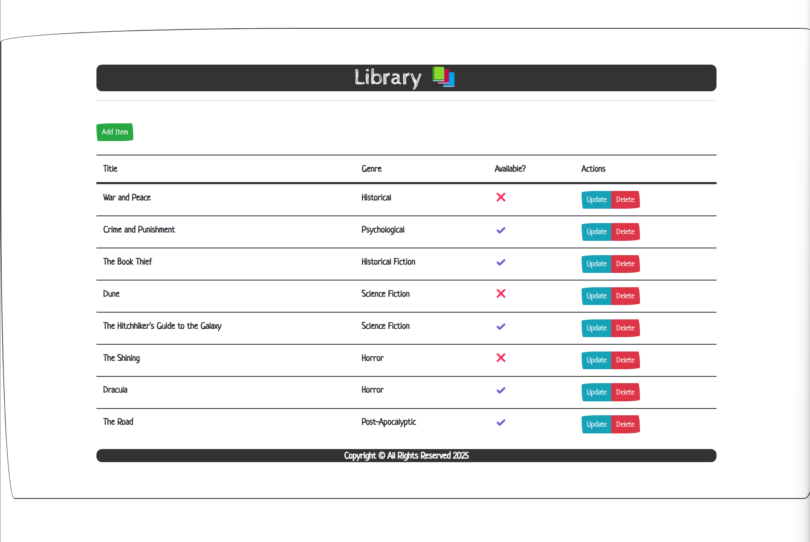
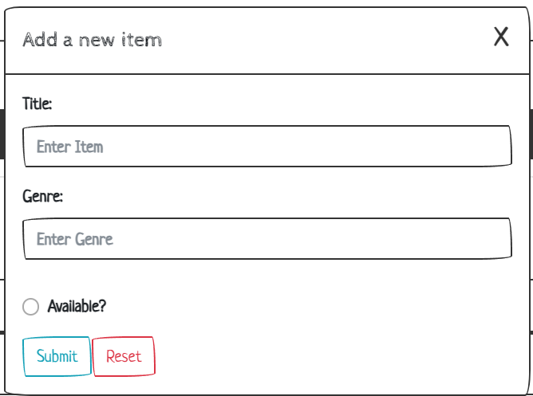
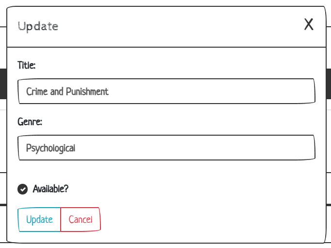

# Library Application

## Overview
The **Library Application** is a full-stack web application built using **Flask** (backend) and **Vue.js** (frontend). It allows users to browse, search, and manage a collection of books.

## Features
- 📚 **Browse Books** – View a list of available books.
- 🔍 **Search** – Search for books by title or author.
- 📖 **Book Details** – View detailed information about each book.
- ➕ **Add Books** – Add new books to the collection (admin feature).
- 🗑️ **Delete Books** – Remove books from the collection (admin feature).
- 🔐 **User Authentication** – Login/logout system to manage book modifications.

---

## Tech Stack
### **Frontend** (Vue.js)
- Vue 3
- Vue Router
- Axios (for API requests)
- Bootstrap (for styling)

### **Backend** (Flask)
- Flask
- Flask-RESTful (for API endpoints)
- Flask-SQLAlchemy (for database management)
- Flask-JWT-Extended (for authentication)
- SQLite/PostgreSQL (for data storage)

---

## Installation
### **1. Clone the Repository**
```sh
git clone https://github.com/yourusername/library-app.git
cd library-app
```

### **2. Backend Setup (Flask)**
```sh
cd backend
python -m venv venv  # Create virtual environment
source venv/bin/activate  # Activate (Linux/macOS)
venv\Scripts\activate  # Activate (Windows)
pip install -r requirements.txt  # Install dependencies
flask run  # Start backend server
```

### **3. Frontend Setup (Vue.js)**
```sh
cd frontend
npm install  # Install dependencies
npm run dev  # Start Vue development server
```

---

## API Endpoints
### **Books**
| Method | Endpoint        | Description                |
|--------|----------------|----------------------------|
| GET    | `/api/books`   | Fetch all books           |
| GET    | `/api/books/<id>` | Fetch book by ID       |
| POST   | `/api/books`   | Add a new book (admin)    |
| PUT    | `/api/books/<id>` | Update a book (admin) |
| DELETE | `/api/books/<id>` | Delete a book (admin) |

### **Authentication**
| Method | Endpoint       | Description           |
|--------|---------------|-----------------------|
| POST   | `/api/login`  | User login           |
| POST   | `/api/logout` | User logout          |

---

## UI Showcase
### **Screenshots & Demo**
Include screenshots or GIFs of your app in action here.

### Home Page


### Adding Item


### Removing Item


### Updating Item

---

## Environment Variables
Create a `.env` file in the backend directory and add the following:
```
SECRET_KEY=your_secret_key
DATABASE_URL=sqlite:///library.db
JWT_SECRET_KEY=your_jwt_secret_key
```

---

## Deployment
### **1. Deploy Backend (Flask)**
- Use **Gunicorn** for deployment:
```sh
pip install gunicorn
```
- Run Gunicorn server:
```sh
gunicorn -w 4 -b 0.0.0.0:5000 app:app
```

### **2. Deploy Frontend (Vue.js)**
- Build Vue for production:
```sh
npm run build
```
- Serve using **Nginx** or a static file server.

---

## Contributing
1. Fork the repository.
2. Create a new branch: `git checkout -b feature-branch`
3. Commit changes: `git commit -m 'Add new feature'`
4. Push to branch: `git push origin feature-branch`
5. Open a pull request.

---

## License
This project is licensed under the MIT License.

